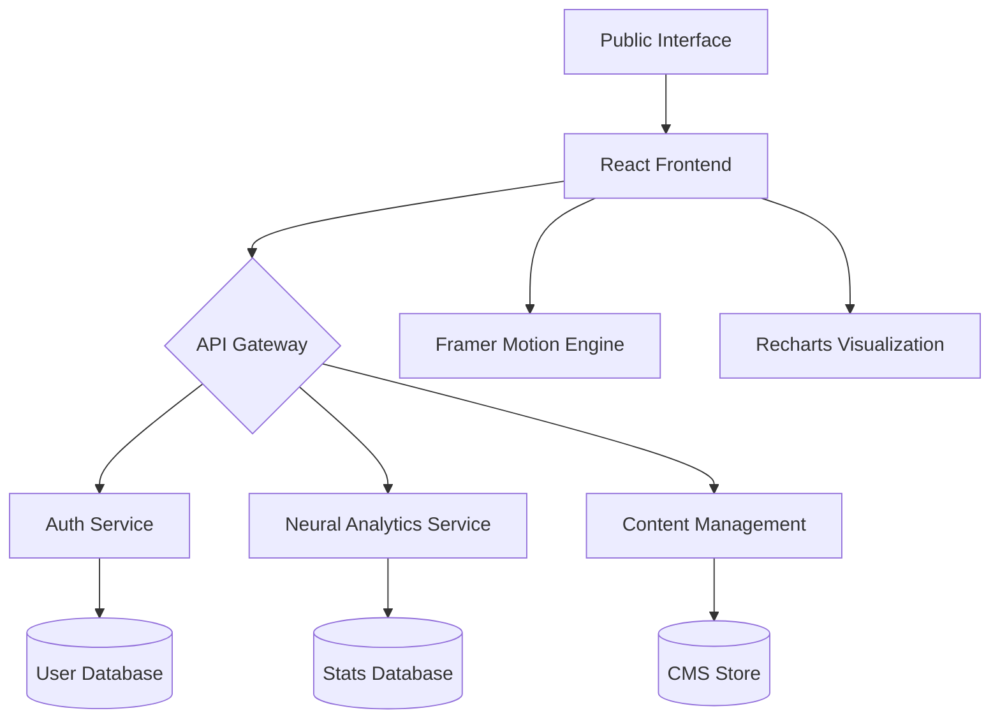

# Sarvam AI: Decentralized Neural Infrastructure


**Sarvam AI** is a high-performance, futuristic SaaS platform designed for the next generation of decentralized intelligence. Built with a focus on glassmorphism aesthetics and premium user experiences, it provides a comprehensive interface for managing autonomous agent swarms, neural mesh networks, and quantum-safe protocols.

---

## 🌌 Core Vision

At Sarvam AI, we believe the future of intelligence is decentralized. Our platform serves as the neural substrate where human intent meets autonomous execution. We provide the tools for architects to build, deploy, and scale cognitive ecosystems that are resilient, private, and exponentially more capable than traditional centralized models.

---

## 🚀 Key Features

### 1. Neural Hero Interface
- **Dynamic Canvas**: A 3D-inspired neural network background that responds to user interaction.
- **Glassmorphism Design**: High-end UI elements with multi-layered blurs and subtle glows.

### 2. Operations Control (Dashboard)
- **Synapse Analytics**: Real-time visualization of neural node acquisition and revenue propagation using Recharts.
- **Node Management**: A centralized interface for provisioning and monitoring decentralized neural nodes.
- **Rapid Protocols**: Quick-action terminal for initializing nodes, data uplinks, and system logs.

### 3. Public Ecosystem
- **Neural Protocols**: A deep-dive into autonomous agents, neural fine-tuning, and predictive synapses.
- **The Neural Frontier (About)**: Our story, values, and the vision behind the decentralized mesh.
- **Neural Logbook (Blog)**: Technical insights and research papers on the cutting edge of AI.
- **The Neural Nexus (Contact)**: A futuristic communication terminal for global collaboration.

### 4. Architect Onboarding (Auth)
- **Secure Neural Link**: 256-bit quantum-safe encryption for session management.
- **Node Registration**: A streamlined process for new architects to join the global mesh.

---

## 🛠 Technology Stack

### Frontend
- **Framework**: [React](https://reactjs.org/) + [Vite](https://vitejs.dev/)
- **Styling**: [Tailwind CSS v4](https://tailwindcss.com/) (Modern utility-first framework)
- **Animations**: [Framer Motion](https://www.framer.com/motion/) (Smooth transitions and scroll-triggered effects)
- **Icons**: [Lucide React](https://lucide.dev/) (Futuristic icon set)
- **Charts**: [Recharts](https://recharts.org/) (Declarative data visualization)

### Backend
- **Framework**: [FastAPI](https://fastapi.tiangolo.com/) (High-performance Python API)
- **Database**: [SQLite](https://www.sqlite.org/) (Local development) / [PostgreSQL](https://www.postgresql.org/) (Production ready)
- **Auth**: JWT-based secure authentication with refresh token logic.

---

## 🏗 System Architecture



---

## 🎨 Design System

Our design language is rooted in **"Neural Glassmorphism"**—a blend of transparency, light, and depth that feels both advanced and organic.

- **Primary**: `hsl(244, 76%, 63%)` (Indigo Neural Pulse)
- **Secondary**: `hsl(271, 91%, 65%)` (Purple Synapse)
- **Background**: `#0a0a0a` (The Deep Void)
- **Typography**: 
  - *Display*: `Outfit` (Bold, futuristic, wide kerning)
  - *Body*: `Inter` (Clean, highly readable)

---

## 🏁 Getting Started

### Prerequisites
- Node.js (v18+)
- Python 3.9+
- Pip & Virtualenv

### Frontend Setup
1. Navigate to the root directory.
2. Install dependencies:
   ```bash
   npm install
   ```
3. Launch the development server:
   ```bash
   npm run dev
   ```

### Backend Setup
1. Navigate to the `backend` directory.
2. Create and activate a virtual environment:
   ```bash
   python -m venv venv
   source venv/bin/activate  # On Windows: .\venv\Scripts\activate
   ```
3. Install requirements:
   ```bash
   pip install -r requirements.txt
   ```
4. Start the API server:
   ```bash
   uvicorn main:app --reload
   ```

---

## 📂 Project Structure

```text
├── backend/               # FastAPI backend services
│   ├── core/              # Security and config logic
│   ├── routes/            # API endpoint definitions
│   ├── models.py          # Database schemas
│   └── main.py            # Entry point
├── src/                   # React frontend source
│   ├── components/        # Reusable UI components
│   │   └── home/          # Landing page specific sections
│   ├── pages/             # Page components
│   │   ├── auth/          # Login & Register
│   │   └── dashboard/     # Admin interface
│   ├── store/             # Redux state management
│   └── index.css          # Global styles & Tailwind theme
├── public/                # Static assets
└── vite.config.js         # Frontend configuration
```

---

## 📜 Documentation & API

For a full breakdown of the API endpoints, visit the Swagger UI at:
`http://localhost:8000/docs`

For detailed component documentation, refer to [DOCUMENTATION.md](./DOCUMENTATION.md).

---

## 🤝 Contributing

We welcome contributions from the neural architect community. Please read our [CONTRIBUTING.md](./CONTRIBUTING.md) for details on our code of conduct and the process for submitting pull requests.

---

## 🛡 License

This project is licensed under the Sarvam Proprietary License. See the [LICENSE.md](./LICENSE.md) file for details.

---
*Developed by the Sarvam AI Protocol Team*
